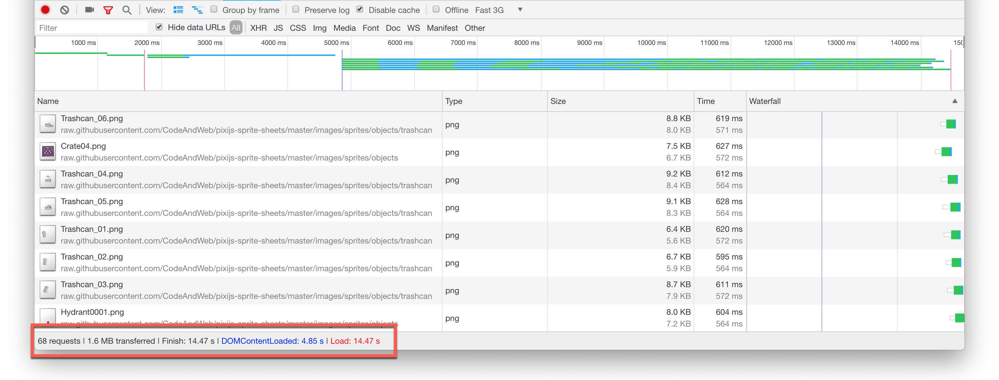
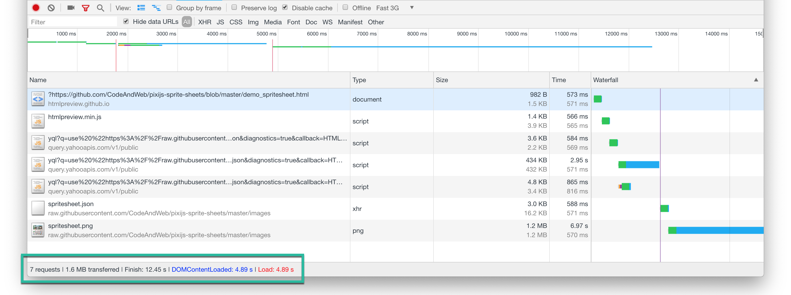
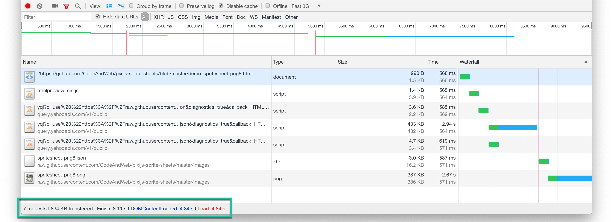

# How to optimize your PixiJS game for fast loading

This small demo app shows how you can use sprite sheets to optimize the loading time of your PixiJS game.

Please visit our full tutorial [How to create sprite sheets and animations with PixiJS](https://www.codeandweb.com/texturepacker/tutorials/how-to-create-sprite-sheets-and-animations-with-pixijs).

Loading times measured on a local network, simulated with Chrome: Fast 3G network.

### Loading single sprites (a bad idea!) ~ 14.5s

The first demo loads all sprites as single images. You see that Chrome makes 68 requests with a total of 1.6MB. The scene is ready after 14.5s.

[Single sprite demo](https://htmlpreview.github.io/?https://github.com/CodeAndWeb/pixijs-sprite-sheets/blob/master/demo_single.html)

### Loading sprites from a sprite sheet (good) ~ 12.5s

This demo uses a single sprite sheet containing all assets.
The demo uses a 32 bit png file for full quality.

The scene is loaded after 11s, in 7 requests with a total of 1.6MB loaded from the server.

[Sprite sheet demo](https://htmlpreview.github.io/?https://github.com/CodeAndWeb/pixijs-sprite-sheets/blob/master/demo_spritesheet.html)

### Loading sprites from an optimized sprite sheet (best): ~ 8s

This demo uses the sprite sheet from above, this time reduced to png-8. The loading time is below 7s.
The number of requests is 7 with 834Kb loaded from the server.

[Optimized sprite sheet demo](https://htmlpreview.github.io/?https://github.com/CodeAndWeb/pixijs-sprite-sheets/blob/master/demo_spritesheet-png8.html)

