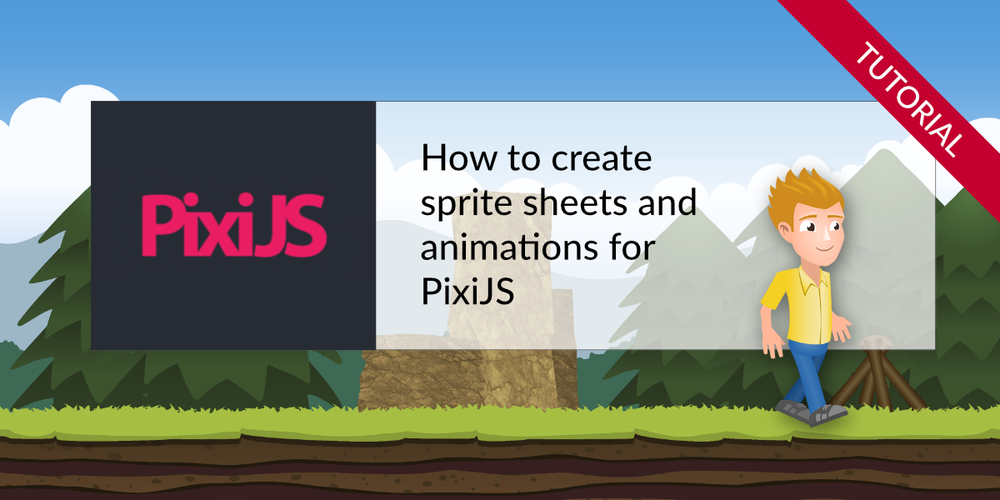

# PixiJS Sprite Sheet Example

This is the demo code for our tutorial [How to create sprite sheets & animations for PixiJS](https://www.codeandweb.com/texturepacker/tutorials/how-to-create-sprite-sheets-and-animations-with-pixijs)
